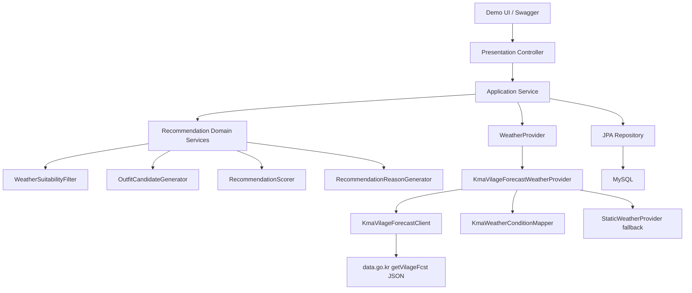
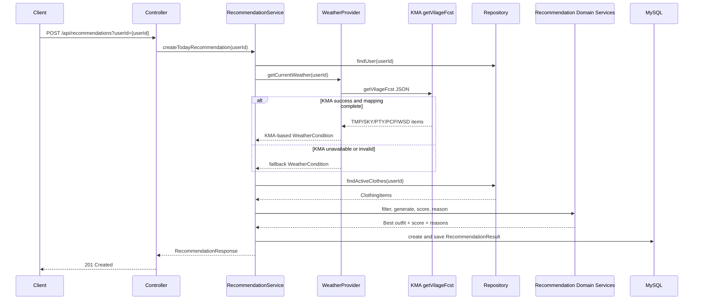

# 아키텍처: SmartCloset 1.5차 MVP

## 전체 아키텍처 개요
SmartCloset 1.5차 MVP는 1차 Spring Boot 4.0.6 백엔드 추천 도메인과 REST API 계약을 유지하면서, 날씨 입력 source를 기상청 단기예보 JSON으로 확장한다.

전체 요청 흐름은 기존 계층 구조를 유지한다.

```text
Controller -> Application Service -> Domain Service -> Repository / Provider
```

Controller는 HTTP 요청과 응답만 처리한다. Application Service는 유스케이스와 트랜잭션 경계를 관리한다. 추천 후보 생성, 점수 계산, 추천 실패 판단, 추천 이유 생성은 Domain Service에서 처리한다. Repository는 JPA 기반 데이터 접근만 담당한다.

날씨는 `WeatherProvider` 인터페이스로 추상화한다. 1.5차 기본 구현은 기상청 단기예보 `getVilageFcst` JSON 응답을 사용하는 `KmaVilageForecastWeatherProvider`이며, API key 미설정 또는 외부 API 실패 시 `StaticWeatherProvider` fallback 값을 사용한다.

정식 프론트엔드 앱은 계속 제외한다. Demo UI는 Spring Boot 정적 리소스 기반 단일 페이지로 유지한다.

## 권장 패키지 구조

```text
com.smartcloset
├── SmartClosetApplication
├── common
│   ├── exception
│   ├── response
│   └── config
├── user
│   ├── domain
│   ├── repository
│   └── application
├── clothing
│   ├── domain
│   ├── repository
│   ├── application
│   ├── presentation
│   └── dto
├── weather
│   ├── domain
│   ├── application
│   └── infrastructure
│       ├── kma
│       └── fallback
└── recommendation
    ├── domain
    ├── application
    ├── repository
    ├── presentation
    └── dto
```

최소 Demo UI는 Java package가 아니라 Spring Boot static resource로 둔다.

```text
src/main/resources/static/demo/index.html
src/main/resources/static/demo/app.js
src/main/resources/static/demo/style.css
```

## 계층별 책임

### presentation/controller
- HTTP 요청/응답 처리
- request validation
- Application Service 호출
- DTO 변환
- 비즈니스 규칙 직접 처리 금지

### application/service
- 유스케이스 조합
- 트랜잭션 경계 관리
- Repository 호출
- `WeatherProvider` 호출
- Domain Service 호출
- 응답 DTO 구성

### domain
- Entity, Enum, Value Object
- 추천 후보 생성 규칙
- 점수 계산 규칙
- 추천 실패 판단
- 추천 이유 생성 규칙
- 가능한 한 순수 Java 로직으로 유지

Recommendation domain service의 책임은 1차 MVP와 동일하다.

- `WeatherSuitabilityFilter`: 날씨 조건에 맞지 않는 옷 제외
- `OutfitCandidateGenerator`: TOP/BOTTOM 또는 TOP/BOTTOM/OUTER 조합 생성
- `RecommendationScorer`: weather/color/wear history/recommendation history/diversity 점수 계산
- `RecommendationReasonGenerator`: 점수 규칙 결과를 템플릿 문장으로 변환

### repository
- JPA 기반 데이터 접근
- Entity 저장/조회
- 추천 점수 계산 로직 금지
- 후보 조합 생성 로직 금지

### infrastructure/provider
- `WeatherProvider#getCurrentWeather(Long userId)` 구현
- KMA API 호출, JSON 응답 파싱, category 매핑
- 외부 API 오류를 fallback으로 변환
- 추천 도메인이 KMA 응답 DTO에 의존하지 않도록 내부 `WeatherCondition`으로 변환

## Weather Provider 구조
1.5차에서 `RecommendationService`는 여전히 `WeatherProvider` 인터페이스에만 의존한다.

```text
RecommendationService
  -> WeatherProvider
      -> KmaVilageForecastWeatherProvider
          -> KmaVilageForecastClient
          -> KmaForecastBaseTimeCalculator
          -> KmaWeatherConditionMapper
          -> StaticWeatherProvider fallback
```

구현 책임:

- `KmaVilageForecastWeatherProvider`: 외부 API 호출 흐름을 조합하고 fallback 정책을 적용한다.
- `KmaVilageForecastClient`: `getVilageFcst` HTTP 요청과 JSON 응답 수신을 담당한다.
- `KmaForecastBaseTimeCalculator`: 단기예보 발표시각과 API 제공 시각 기준으로 `base_date`, `base_time`을 계산한다.
- `KmaWeatherConditionMapper`: `TMP`, `SKY`, `PTY`, `PCP`, `WSD`를 내부 `WeatherCondition`으로 매핑한다.
- `StaticWeatherProvider`: fallback/test 날씨를 제공한다.

`KmaVilageForecastClient`는 추천 점수나 후보 생성 규칙을 알지 않는다. `KmaWeatherConditionMapper`는 KMA category를 내부 모델로 바꾸는 역할만 맡는다.

Spring bean 구성은 아래처럼 고정한다.

- `KmaVilageForecastWeatherProvider`는 1.5차 기본 `WeatherProvider` bean이며 `@Primary`를 사용한다.
- `StaticWeatherProvider`는 `WeatherProvider` 구현체로 남기되 fallback/test 용도로 사용한다.
- `KmaVilageForecastWeatherProvider`가 fallback을 사용할 때는 `StaticWeatherProvider` concrete type을 주입받아 `WeatherProvider` 다중 bean 충돌을 피한다.

## 핵심 도메인 경계
- `User`: 인증 없는 테스트용 사용자. API는 `userId` request parameter로 식별한다.
- `ClothingItem`: 사용자가 등록한 옷. `category`, `color`, `material`, `minTemperature`, `maxTemperature`, `rainSuitable`, `archived`를 가진다.
- `WeatherCondition`: 추천 로직에서 사용하는 내부 날씨 상태. 외부 API 응답 모델과 분리한다.
- `WeatherProvider`: 현재 추천에 사용할 `WeatherCondition`을 제공하는 인터페이스. 시그니처는 `getCurrentWeather(Long userId)`로 유지한다.
- `KmaVilageForecastWeatherProvider`: 기상청 단기예보 JSON 기반 1.5차 기본 구현체다. Spring bean은 `@Primary`로 등록한다.
- `StaticWeatherProvider`: 서비스키 미설정, 외부 API 오류, 테스트 상황에서 사용하는 fallback 구현체다.
- `OutfitCandidate`: TOP/BOTTOM 또는 TOP/BOTTOM/OUTER 조합. DB Entity가 아니라 추천 계산 중 생성되는 도메인 모델 또는 value object다.
- `RecommendationScore`: `totalScore`, `weatherScore`, `colorScore`, `wearHistoryScore`, `recommendationHistoryScore`, `diversityScore`를 가진다.
- `RecommendationReason`: AI 생성 문장이 아니라 규칙 결과를 템플릿 문장으로 변환한 추천 이유다.
- `RecommendationResult`: 저장된 추천 결과. 1.5차에서는 기존 weather snapshot 필드를 그대로 저장한다.
- `WearHistory`: 실제 착용 완료 이력이며 이후 추천 점수에 반영한다.

## 추천 유스케이스 흐름
`POST /api/recommendations?userId={userId}` 요청 흐름은 다음과 같다.

1. `userId`로 seed/test user를 조회한다.
2. `WeatherProvider#getCurrentWeather(Long userId)`로 `WeatherCondition`을 조회한다.
3. KMA 설정이 유효하면 `getVilageFcst` JSON을 호출한다.
4. KMA 응답에서 `TMP`, `SKY`, `PTY`, `PCP`, `WSD`를 매핑한다.
5. KMA 호출 또는 매핑이 실패하면 `WEATHER_FALLBACK_ENABLED=true`에서는 fallback `WeatherCondition`을 사용하고, `false`에서는 `INTERNAL_SERVER_ERROR`로 실패한다.
6. `archived=false`인 옷 목록을 조회한다.
7. 날씨 조건에 맞지 않는 옷을 필터링한다.
8. TOP/BOTTOM 또는 TOP/BOTTOM/OUTER 조합을 생성한다.
9. 후보 조합별 점수를 계산한다.
10. 최근 착용 이력과 최근 추천 이력을 반영한다.
11. 최고 점수 후보를 선택한다.
12. 추천 이유를 생성한다.
13. `RecommendationResult`를 생성하고 저장한다.
14. 응답 DTO를 반환한다.

## KMA 요청 구성
외부 호출은 아래 endpoint로 제한한다.

```text
GET {KMA_BASE_URL}/getVilageFcst
```

기본 base URL:

```text
http://apis.data.go.kr/1360000/VilageFcstInfoService_2.0
```

요청 parameter:

| Parameter | Source |
| --- | --- |
| `serviceKey` | `KMA_SERVICE_KEY` |
| `pageNo` | fixed `1` |
| `numOfRows` | fixed `1000` |
| `dataType` | fixed `JSON` |
| `base_date` | `KmaForecastBaseTimeCalculator` |
| `base_time` | `KmaForecastBaseTimeCalculator` |
| `nx` | `KMA_NX`, 기본 `60` |
| `ny` | `KMA_NY`, 기본 `127` |

단기예보 발표시각:

```text
0200, 0500, 0800, 1100, 1400, 1700, 2000, 2300
```

각 발표시각 10분 이후부터 API에서 사용할 수 있다고 보고, 현재 KST 기준 제공 가능한 최신 발표시각을 선택한다.

## WeatherCondition 매핑
KMA 응답 item은 같은 forecast time끼리 묶어서 사용한다.

forecast target time 선택 기준은 현재 KST 이후 가장 가까운 예보시각이다. `KmaWeatherConditionMapper`는 `fcstDate`, `fcstTime` group을 오름차순으로 정렬하고 요청 시각 이후 첫 group을 선택한다. 선택 group에 필수 category가 하나라도 누락되거나 값 파싱에 실패하면 다른 group으로 이동하지 않고 provider에 실패를 반환한다.

| Internal field | KMA category | Mapping |
| --- | --- | --- |
| `temperature` | `TMP` | `fcstValue`를 정수 섭씨로 변환 |
| `weatherType` | `PTY`, `SKY` | `PTY` 우선, `PTY=0`이면 `SKY` 사용 |
| `rainy` | `PTY`, `PCP` | `PTY != 0` 또는 유효 강수량이면 true |
| `windy` | `WSD` | `WSD >= 4.0`이면 true |

Weather type:

| KMA value | WeatherType |
| --- | --- |
| `PTY=1`, `PTY=2`, `PTY=4` | `RAINY` |
| `PTY=3` | `SNOWY` |
| `PTY=0`, `SKY=1` | `SUNNY` |
| `PTY=0`, `SKY=3` 또는 `SKY=4` | `CLOUDY` |

`PCP`가 `-`, `null`, `0`, `강수없음`이면 강수 없음으로 본다.

## Fallback 정책
`WEATHER_FALLBACK_ENABLED=true`에서는 아래 상황에서 `StaticWeatherProvider`의 fallback 값을 사용한다.

- `KMA_SERVICE_KEY`가 비어 있음
- KMA HTTP 호출 실패
- KMA `resultCode`가 `00`이 아님
- `NODATA_ERROR`
- `items.item`이 비어 있음
- 선택 forecast time에서 필수 category 누락
- `TMP`, `PTY`, `SKY`, `PCP`, `WSD` 값 파싱 실패

fallback 값:

| Field | Value |
| --- | --- |
| `temperature` | `12` |
| `weatherType` | `CLOUDY` |
| `rainy` | `false` |
| `windy` | `false` |

1.5차에서는 fallback 발생 여부를 DB에 저장하지 않는다. 필요하면 로그로만 남긴다.

`WEATHER_FALLBACK_ENABLED=false`는 strict KMA mode다. strict mode에서는 위 상황에서 fallback하지 않고 `INTERNAL_SERVER_ERROR`로 실패하며, 추천 실패 코드 5종으로 변환하지 않고 `RecommendationResult`를 저장하지 않는다.

## 의존 방향 규칙
- Controller는 Application Service에만 의존한다.
- Service는 Repository, `WeatherProvider`, Domain Service를 조합한다.
- Domain 로직은 Controller, JPA, HTTP, Swagger, KMA DTO에 의존하지 않는다.
- `RecommendationService`는 KMA client를 직접 호출하지 않는다.
- `RecommendationService`는 `WeatherProvider` 인터페이스에만 의존한다.
- Repository는 추천 점수 계산을 하지 않는다.
- KMA 응답 DTO는 `weather.infrastructure` 밖으로 노출하지 않는다.

## 트랜잭션 경계
- 옷 등록/수정/보관 처리: write transaction
- 옷 목록/상세 조회: readOnly transaction
- 추천 생성: `RecommendationResult`를 생성하고 저장하므로 write transaction
- 착용 완료 처리: `RecommendationResult` 상태 변경과 `WearHistory` 저장이 필요하므로 write transaction

외부 KMA 호출은 DB transaction을 길게 잡지 않도록 구현하는 것을 권장한다. 구현상 서비스 메서드 경계가 유지되더라도, KMA 호출과 추천 저장 책임은 명확히 분리한다.

## 테스트 전략
- KMA base date/time 계산 단위 테스트
- KMA JSON 응답 mapper 단위 테스트
- KMA 오류/fallback provider 테스트
- 추천 점수 계산 순수 도메인 단위 테스트 유지
- 날씨 필터링 도메인 단위 테스트 유지
- API는 controller slice test 또는 통합 테스트로 검증
- Docker Compose 실행 후 README 시나리오로 수동 검증

## 계층 구조 다이어그램



## 추천 요청 Sequence Diagram



## 명시적 비범위
- 로그인/회원가입
- 사용자별 위치 저장
- 위치 변경 API
- Weather source DB 저장
- Redis 캐싱
- AI/GPT 추천
- 이미지 업로드
- 정식 프론트엔드 앱
- AWS 배포
- CD 자동화

## 결정된 사항
- Spring Boot 버전은 `4.0.6`이다.
- 추천 생성 API 계약은 `POST /api/recommendations?userId={userId}`이다.
- Docker Compose는 필수 공유 방식이다.
- 기본 격자는 서울특별시 `nx=60`, `ny=127`이다.
- forecast target time은 현재 KST 이후 가장 가까운 `fcstDate`, `fcstTime` group이다.
- KMA provider는 `@Primary` `WeatherProvider` bean이며, fallback은 concrete `StaticWeatherProvider`를 사용한다.
- `WEATHER_FALLBACK_ENABLED=false`는 strict KMA mode로 처리한다.
- KMA 연동 결정은 `docs/adr/006-kma-vilage-forecast-weather-provider.md`를 따른다.
