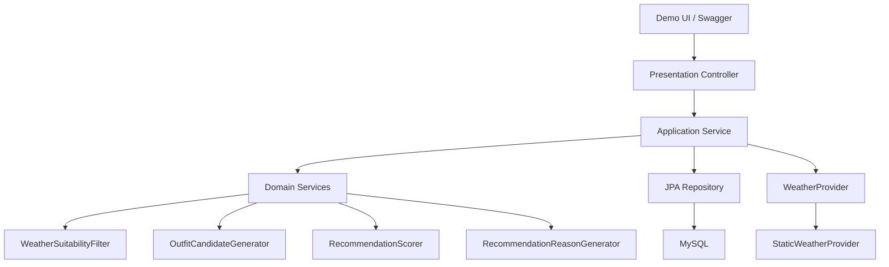
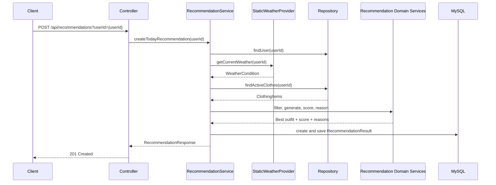

# 아키텍처: SmartCloset 1차 MVP

## 전체 아키텍처 개요
SmartCloset 1차 MVP는 Spring Boot 4.0.6 백엔드 추천 도메인과 REST API 구현을 중심으로 한다. 공유 방식은 Docker Compose로 고정하며, Spring Boot 애플리케이션과 MySQL을 함께 실행한다.

전체 요청 흐름은 다음 계층을 따른다.

```text
Controller -> Application Service -> Domain Service -> Repository / Provider
```

Controller는 HTTP 요청과 응답만 처리하고, 추천 로직을 직접 수행하지 않는다. Application Service는 유스케이스를 조합하고 트랜잭션 경계를 관리한다. 추천 후보 생성, 점수 계산, 추천 실패 판단, 추천 이유 생성은 Domain Service에서 처리한다. Repository는 JPA 기반 데이터 접근만 담당하며 추천 점수 계산을 하지 않는다.

1차 MVP는 외부 Weather API를 연동하지 않는다. 날씨는 `WeatherProvider` 인터페이스를 통해 제공되며, 구현체는 `StaticWeatherProvider` 하나로 고정한다. `StaticWeatherProvider`는 고정된 테스트 날씨를 내부 `WeatherCondition`으로 반환한다.

정식 프론트엔드 앱은 제외한다. P1 범위의 최소 데모 UI는 Spring Boot 정적 리소스 기반 단일 페이지로만 제공한다.

## 권장 패키지 구조

```text
com.smartcloset
├── SmartClosetApplication
├── common
│   ├── exception
│   ├── response
│   └── config
├── user
│   ├── domain
│   ├── repository
│   └── application
├── clothing
│   ├── domain
│   ├── repository
│   ├── application
│   ├── presentation
│   └── dto
├── weather
│   ├── domain
│   ├── application
│   └── infrastructure
└── recommendation
    ├── domain
    ├── application
    ├── repository
    ├── presentation
    └── dto
```

최소 데모 UI는 Java package가 아니라 Spring Boot static resource로 둔다.

```text
src/main/resources/static/demo/index.html
src/main/resources/static/demo/app.js
src/main/resources/static/demo/style.css
```

## 계층별 책임

### presentation/controller
- HTTP 요청/응답 처리
- request validation
- Application Service 호출
- DTO 변환
- 비즈니스 규칙 직접 처리 금지

### application/service
- 유스케이스 조합
- 트랜잭션 경계 관리
- Repository 호출
- `WeatherProvider` 호출
- Domain Service 호출
- 응답 DTO 구성

### domain
- Entity, Enum, Value Object
- 추천 후보 생성 규칙
- 점수 계산 규칙
- 추천 실패 판단
- 추천 이유 생성 규칙
- 가능한 한 순수 Java 로직으로 유지

Recommendation domain service의 최소 책임은 다음과 같다.
- `WeatherSuitabilityFilter`: 날씨 조건에 맞지 않는 옷 제외
- `OutfitCandidateGenerator`: TOP/BOTTOM 또는 TOP/BOTTOM/OUTER 조합 생성
- `RecommendationScorer`: weather/color/wear history/recommendation history/diversity 점수 계산
- `RecommendationReasonGenerator`: 점수 규칙 결과를 템플릿 문장으로 변환

### repository
- JPA 기반 데이터 접근
- Entity 저장/조회
- 추천 점수 계산 로직 금지
- 후보 조합 생성 로직 금지

### infrastructure/provider
- `StaticWeatherProvider` 구현
- `WeatherProvider#getCurrentWeather(Long userId)` 구현
- 외부 Weather API 실제 연동은 1차 MVP에서 구현하지 않음

## 핵심 도메인 경계
- `User`: 인증 없는 테스트용 사용자. seed user를 제공하며 API는 `userId` request parameter로 식별한다.
- `ClothingItem`: 사용자가 등록한 옷. `category`, `color`, `material`, `minTemperature`, `maxTemperature`, `rainSuitable`, `archived`를 가진다. `archived=true`인 옷은 추천 후보에서 제외한다.
- `WeatherCondition`: 추천 로직에서 사용하는 내부 날씨 상태. 외부 API 응답 모델과 분리한다.
- `WeatherProvider`: 현재 날씨를 `WeatherCondition`으로 제공하는 인터페이스. 시그니처는 `getCurrentWeather(Long userId)`로 통일한다.
- `StaticWeatherProvider`: 고정 테스트 날씨를 반환하는 1차 MVP 전용 구현체다.
- `OutfitCandidate`: TOP/BOTTOM 또는 TOP/BOTTOM/OUTER 조합. DB Entity가 아니라 추천 계산 중 생성되는 도메인 모델 또는 value object로 설계한다.
- `RecommendationScore`: `totalScore`, `weatherScore`, `colorScore`, `wearHistoryScore`, `recommendationHistoryScore`, `diversityScore`를 가진다.
- `RecommendationReason`: AI 생성 문장이 아니라 규칙 결과를 템플릿 문장으로 변환한 추천 이유다.
- `RecommendationResult`: 저장된 추천 결과. DB 저장 구조는 `docs/ERD.md`를 따른다. 1차 MVP에서는 TOP/BOTTOM 또는 TOP/BOTTOM/OUTER 옷 참조, 점수 breakdown, 추천 이유, `worn` 여부를 저장한다.
- `WearHistory`: 실제 착용 완료 이력이며 이후 추천 점수에 반영한다.

## 추천 유스케이스 흐름
`POST /api/recommendations?userId={userId}` 요청 흐름은 다음과 같다.

1. `userId`로 seed/test user를 조회한다.
2. `WeatherProvider#getCurrentWeather(Long userId)`로 `WeatherCondition`을 조회한다.
3. `archived=false`인 옷 목록을 조회한다.
4. 날씨 조건에 맞지 않는 옷을 필터링한다.
5. TOP/BOTTOM 또는 TOP/BOTTOM/OUTER 조합을 생성한다.
6. 후보 조합별 점수를 계산한다.
7. 최근 착용 이력과 최근 추천 이력을 반영한다.
8. 최고 점수 후보를 선택한다.
9. 추천 이유를 생성한다.
10. `RecommendationResult`를 생성하고 저장한다.
11. 응답 DTO를 반환한다.

## 의존 방향 규칙
- Controller는 Application Service에만 의존한다.
- Service는 Repository, `WeatherProvider`, Domain Service를 조합한다.
- Domain 로직은 Controller, JPA, HTTP, Swagger에 의존하지 않는다.
- `RecommendationService`는 외부 Weather API를 직접 호출하지 않는다.
- `RecommendationService`는 `WeatherProvider` 인터페이스에만 의존한다.
- `StaticWeatherProvider`는 `weather.infrastructure`에 둔다.
- Repository는 추천 점수 계산을 하지 않는다.

## 트랜잭션 경계
- 옷 등록/수정/보관 처리: write transaction
- 옷 목록/상세 조회: readOnly transaction
- 오늘의 추천 생성: `RecommendationResult`를 생성하고 저장하므로 write transaction
- 착용 완료 처리: `RecommendationResult` 상태 변경과 `WearHistory` 저장이 필요하므로 write transaction

## 테스트 전략
- 추천 점수 계산은 순수 도메인 단위 테스트로 검증한다.
- 날씨 필터링은 도메인 단위 테스트로 검증한다.
- 색상, material, 온도 규칙은 독립 테스트로 검증한다.
- `RecommendationService`는 `StaticWeatherProvider`와 repository mock/fake를 사용한 서비스 테스트로 검증한다.
- API는 controller slice test 또는 통합 테스트로 검증한다.
- Docker Compose 실행 후 README 시나리오로 수동 검증한다.

## 계층 구조 다이어그램



## 추천 요청 Sequence Diagram



## 명시적 비범위
아래 항목은 1차 MVP 아키텍처 범위가 아니다.

- 외부 Weather API 실제 연동
- Spring Security 로그인/회원가입
- AI/GPT 추천
- 이미지 업로드
- 정식 프론트엔드 앱
- Redis 캐싱
- AWS 배포
- CD 자동화

## 결정된 사항
- PRD와 충돌하는 내용은 없다.
- Lombok 사용 정책은 `docs/adr/003-mvp-scope-decisions.md`를 따른다.
- 색상 규칙의 세부 매핑은 `docs/RECOMMENDATION_RULES.md`를 따른다.
- OUTER 필수 조건은 `temperature <= 12` 기준이며 `StaticWeatherProvider`의 기본 `temperature=12`에서 OUTER 필수 흐름을 검증한다.
