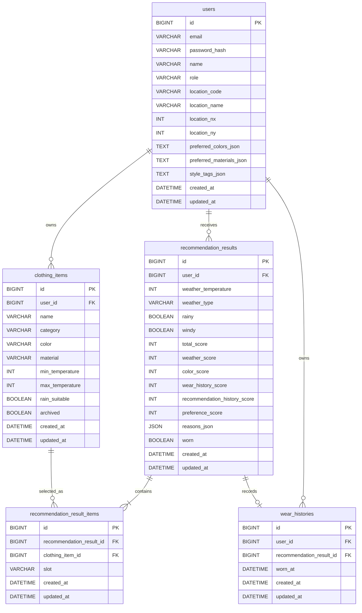

# ERD: SmartCloset Current Baseline

## 0. 현재 DB baseline
현재 baseline은 인증 사용자 기반 전환과 선호도 저장을 위해 `users` 테이블을 확장한 상태다.

## MVP4 작성 메모
MVP4 DB 변경은 아직 확정되지 않았다. 새 테이블, 컬럼, index, migration, backfill 정책은 `docs/PRD.md`와 ADR에서 승인한 뒤 이 문서에 반영한다.

- `users`에 인증 필드 `email`, `password_hash`, `role`을 추가한다.
- `email`은 unique다.
- 기존 위치 snapshot 컬럼은 계속 사용한다.
- 선호도는 `users` 테이블의 JSON 문자열 컬럼으로 저장한다.
  - `preferred_colors_json`
  - `preferred_materials_json`
  - `style_tags_json`
- 신규 사용자는 기본 위치 `SEOUL`과 빈 선호도 배열로 생성한다.
- 선호도 별도 테이블 정규화는 MVP4 후보로 남기되, 승인 전 구현하지 않는다.
- 추천 결과에는 기존 weather snapshot과 score snapshot을 저장한다.
- 추천 결과 위치 source snapshot 저장은 현재 baseline 범위에서 제외한다.
- MVP-3 완료 baseline 전환 시 로컬 Docker Compose DB는 기존 2차 schema/seed data와 충돌할 수 있으므로 `docker compose down -v` 후 재생성을 권장한다.

## 1. 공통 DB 정책
- DB는 MySQL 기준으로 설계한다.
- 모든 JPA Entity는 `BaseTimeEntity`를 상속한다.
- 모든 테이블은 `created_at DATETIME(6) NOT NULL`, `updated_at DATETIME(6) NOT NULL`을 가진다.
- enum은 DB enum이 아니라 `VARCHAR(30)`으로 저장한다.
- `recommendation_results.reasons_json`은 `JSON NOT NULL`로 저장한다.
- Entity에서는 구현 단순성을 위해 JSON 값을 `String`으로 보관한다.
- `users.preferred_colors_json`, `users.preferred_materials_json`, `users.style_tags_json`은 JSON array string으로 보관한다.

## 2. Mermaid ERD


## 3. Tables

### users
| Column | Type | Nullable | Default | Description |
| --- | --- | --- | --- | --- |
| `id` | `BIGINT` | no | auto increment | PK |
| `email` | `VARCHAR(255)` | no | none | 로그인 이메일, unique |
| `password_hash` | `VARCHAR(255)` | no | none | BCrypt hash |
| `name` | `VARCHAR(50)` | no | none | 사용자 표시 이름 |
| `role` | `VARCHAR(30)` | no | `USER` | 기본 role |
| `location_code` | `VARCHAR(30)` | yes | none | 내장 위치 catalog code. 애플리케이션 기본값은 `SEOUL` |
| `location_name` | `VARCHAR(50)` | yes | none | 표시용 위치 이름. 애플리케이션 기본값은 `서울특별시` |
| `location_nx` | `INT` | yes | none | KMA grid X. 애플리케이션 기본값은 `60` |
| `location_ny` | `INT` | yes | none | KMA grid Y. 애플리케이션 기본값은 `127` |
| `preferred_colors_json` | `TEXT` | no | application `[]` | `ClothingColor` 배열 JSON 문자열 |
| `preferred_materials_json` | `TEXT` | no | application `[]` | `ClothingMaterial` 배열 JSON 문자열 |
| `style_tags_json` | `TEXT` | no | application `[]` | style tag 문자열 배열 JSON 문자열 |
| `created_at` | `DATETIME(6)` | no | none | 생성 시각 |
| `updated_at` | `DATETIME(6)` | no | none | 수정 시각 |

Indexes:
- Primary key: `id`
- Unique: `(email)`
- Index: `(location_code)`

Relations:
- `users.id` 1:N `clothing_items.user_id`
- `users.id` 1:N `recommendation_results.user_id`
- `users.id` 1:N `wear_histories.user_id`

User methods:
- `create(email, passwordHash, name)`
- `updateLocation(LocationOption location)`
- `ensureDefaultLocation()`
- `updatePreferences(preferredColors, preferredMaterials, styleTags)`

Signup policy:
- 신규 사용자는 기본 위치 `SEOUL`, `서울특별시`, `60`, `127`을 가진다.
- 신규 사용자의 `preferred_colors_json`, `preferred_materials_json`, `style_tags_json`은 모두 `[]`로 생성한다.
- 기본 role은 `USER`다.

Migration policy:
- 현재 로컬 공유/데모는 Docker Compose volume 초기화를 권장한다.
- 운영 DB migration은 현재 문서 범위에서 다루지 않는다.
- 기존 row에 인증 필드나 선호도 필드가 없어 충돌할 수 있으므로 로컬 전환 명령은 아래를 기준으로 한다.

```bash
docker compose down -v
docker compose up --build
```

### clothing_items
| Column | Type | Nullable | Default | Description |
| --- | --- | --- | --- | --- |
| `id` | `BIGINT` | no | auto increment | PK |
| `user_id` | `BIGINT` | no | none | FK to `users.id` |
| `name` | `VARCHAR(50)` | no | none | 옷 이름 |
| `category` | `VARCHAR(30)` | no | none | `ClothingCategory` |
| `color` | `VARCHAR(30)` | no | none | `ClothingColor` |
| `material` | `VARCHAR(30)` | no | none | `ClothingMaterial` |
| `min_temperature` | `INT` | no | none | 착용 가능 최저 기온 |
| `max_temperature` | `INT` | no | none | 착용 가능 최고 기온 |
| `rain_suitable` | `BOOLEAN` | no | none | 비 오는 날 적합 여부 |
| `archived` | `BOOLEAN` | no | `FALSE` | 보관 여부 |
| `created_at` | `DATETIME(6)` | no | none | 생성 시각 |
| `updated_at` | `DATETIME(6)` | no | none | 수정 시각 |

Indexes:
- Primary key: `id`
- Index: `(user_id, archived, id)`
- Index: `(user_id, category, archived)`

### recommendation_results
| Column | Type | Nullable | Default | Description |
| --- | --- | --- | --- | --- |
| `id` | `BIGINT` | no | auto increment | PK |
| `user_id` | `BIGINT` | no | none | FK to `users.id` |
| `weather_temperature` | `INT` | no | none | 추천 생성 시점의 내부 `WeatherCondition.temperature` snapshot |
| `weather_type` | `VARCHAR(30)` | no | none | 내부 `WeatherCondition.weatherType` snapshot |
| `rainy` | `BOOLEAN` | no | none | 내부 `WeatherCondition.rainy` snapshot |
| `windy` | `BOOLEAN` | no | none | 내부 `WeatherCondition.windy` snapshot |
| `total_score` | `INT` | no | none | 총점 |
| `weather_score` | `INT` | no | none | 날씨 적합도 점수 |
| `color_score` | `INT` | no | none | 색상 조합 점수 |
| `wear_history_score` | `INT` | no | none | 최근 착용 이력 점수 |
| `recommendation_history_score` | `INT` | no | none | 최근 추천 이력 점수 |
| `preference_score` | `INT` | no | none | 선호 색상/소재 점수 |
| `reasons_json` | `JSON` | no | none | 추천 이유 JSON array |
| `worn` | `BOOLEAN` | no | `FALSE` | 착용 완료 여부 |
| `created_at` | `DATETIME(6)` | no | none | 생성 시각 |
| `updated_at` | `DATETIME(6)` | no | none | 수정 시각 |

Indexes:
- Primary key: `id`
- Index: `(user_id, created_at)`
- Index: `(user_id, worn)`

현재 baseline에서는 추천 결과가 사용한 위치 code/nx/ny를 저장하지 않는다. 이 값이 필요한 경우 후속 MVP에서 명시적으로 snapshot 컬럼을 추가한다.

### recommendation_result_items
| Column | Type | Nullable | Default | Description |
| --- | --- | --- | --- | --- |
| `id` | `BIGINT` | no | auto increment | PK |
| `recommendation_result_id` | `BIGINT` | no | none | FK to `recommendation_results.id` |
| `clothing_item_id` | `BIGINT` | no | none | FK to `clothing_items.id` |
| `slot` | `VARCHAR(30)` | no | none | `OutfitSlot` |
| `created_at` | `DATETIME(6)` | no | none | 생성 시각 |
| `updated_at` | `DATETIME(6)` | no | none | 수정 시각 |

Indexes:
- Primary key: `id`
- Index: `(recommendation_result_id)`
- Index: `(clothing_item_id)`
- Unique: `(recommendation_result_id, slot)`

### wear_histories
| Column | Type | Nullable | Default | Description |
| --- | --- | --- | --- | --- |
| `id` | `BIGINT` | no | auto increment | PK |
| `user_id` | `BIGINT` | no | none | FK to `users.id` |
| `recommendation_result_id` | `BIGINT` | no | none | FK to `recommendation_results.id` |
| `worn_at` | `DATETIME(6)` | no | none | 착용 완료 시각 |
| `created_at` | `DATETIME(6)` | no | none | 생성 시각 |
| `updated_at` | `DATETIME(6)` | no | none | 수정 시각 |

Indexes:
- Primary key: `id`
- Index: `(user_id, worn_at)`
- Unique: `(recommendation_result_id)`

WearHistory는 개별 `clothing_item_id`를 중복 저장하지 않는다. 실제 포함 옷은 `recommendation_result_items`를 통해 조회한다.

## 4. 내장 위치 catalog
내장 위치 catalog는 DB 테이블이 아니라 애플리케이션 코드 또는 설정으로 제공한다. `GET /api/locations`는 보호 API이며 로그인 후 위치 선택 화면에서만 호출한다.

| Code | Name | nx | ny |
| --- | --- | ---: | ---: |
| `SEOUL` | 서울특별시 | 60 | 127 |
| `BUSAN` | 부산광역시 | 98 | 76 |
| `DAEGU` | 대구광역시 | 89 | 90 |
| `INCHEON` | 인천광역시 | 55 | 124 |
| `GWANGJU` | 광주광역시 | 58 | 74 |
| `DAEJEON` | 대전광역시 | 67 | 100 |
| `ULSAN` | 울산광역시 | 102 | 84 |
| `SEJONG` | 세종특별자치시 | 66 | 103 |
| `JEJU` | 제주특별자치도 | 52 | 38 |

## 5. Entity 설계 기준
- Entity에 Lombok `@Data`, `@Setter`를 사용하지 않는다.
- Entity 변경은 의도가 드러나는 메서드로 제한한다.
- `User` 위치 변경은 `updateLocation` 같은 명시적 메서드로만 수행한다.
- `User` 선호도 변경은 `updatePreferences` 같은 명시적 메서드로만 수행한다.
- Repository에는 추천 점수 계산, 위치 catalog 검색 규칙, KMA 매핑 로직을 넣지 않는다.
