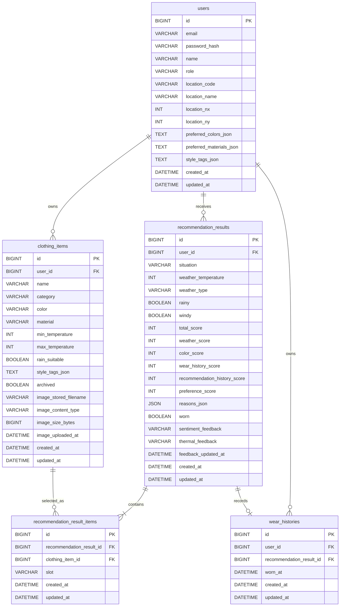

# ERD: SmartCloset MVP6

## 0. DB Baseline

MVP6 DB baseline은 MVP5 인증 사용자 기반 옷 이미지 schema에 옷별 `styleTags`, 추천 상황 snapshot, 추천 피드백 snapshot을 추가한다.

## MVP6 DB 결정

- `clothing_items`에 `style_tags_json`을 추가한다.
- 추천 상황은 `recommendation_results.situation`에 저장한다.
- 추천 피드백은 `recommendation_results` row의 최신 snapshot으로 저장한다.
- 별도 feedback event log table은 만들지 않는다.
- 착용 이력은 기존 `wear_histories`를 유지한다.
- 옷 이미지 파일 bytes는 계속 DB에 저장하지 않는다.
- 추천 결과 item은 기존처럼 `clothing_items`를 참조한다.

## 1. 공통 DB 정책

- DB는 MySQL 기준으로 설계한다.
- 모든 JPA Entity는 `BaseTimeEntity`를 상속한다.
- 모든 테이블은 `created_at DATETIME(6) NOT NULL`, `updated_at DATETIME(6) NOT NULL`을 가진다.
- enum은 DB enum이 아니라 `VARCHAR(30)`으로 저장한다.
- JSON 값은 구현 단순성을 위해 Entity에서 `String`으로 보관한다.
- 운영 DB migration 전략은 별도 migration 도구 없이 Hibernate `ddl-auto=update`와 로컬 Docker Compose volume 초기화 기준으로 검증한다.

## 2. Mermaid ERD

## 3. Tables

### users

| Column | Type | Nullable | Default | Description |
| --- | --- | --- | --- | --- |
| `id` | `BIGINT` | no | auto increment | PK |
| `email` | `VARCHAR(255)` | no | none | 로그인 이메일, unique |
| `password_hash` | `VARCHAR(255)` | no | none | BCrypt hash |
| `name` | `VARCHAR(50)` | no | none | 사용자 표시 이름 |
| `role` | `VARCHAR(30)` | no | `USER` | 기본 role |
| `location_code` | `VARCHAR(30)` | yes | none | 내장 위치 catalog code |
| `location_name` | `VARCHAR(50)` | yes | none | 표시용 위치 이름 |
| `location_nx` | `INT` | yes | none | KMA grid X |
| `location_ny` | `INT` | yes | none | KMA grid Y |
| `preferred_colors_json` | `TEXT` | no | application `[]` | `ClothingColor` 배열 JSON 문자열 |
| `preferred_materials_json` | `TEXT` | no | application `[]` | `ClothingMaterial` 배열 JSON 문자열 |
| `style_tags_json` | `TEXT` | no | application `[]` | 선호 style tag 배열 JSON 문자열 |
| `created_at` | `DATETIME(6)` | no | none | 생성 시각 |
| `updated_at` | `DATETIME(6)` | no | none | 수정 시각 |

Indexes:

- Primary key: `id`
- Unique: `(email)`
- Index: `(location_code)`

### clothing_items

| Column | Type | Nullable | Default | Description |
| --- | --- | --- | --- | --- |
| `id` | `BIGINT` | no | auto increment | PK |
| `user_id` | `BIGINT` | no | none | FK to `users.id` |
| `name` | `VARCHAR(50)` | no | none | 옷 이름 |
| `category` | `VARCHAR(30)` | no | none | `ClothingCategory` |
| `color` | `VARCHAR(30)` | no | none | `ClothingColor` |
| `material` | `VARCHAR(30)` | no | none | `ClothingMaterial` |
| `min_temperature` | `INT` | no | none | 착용 가능 최저 기온 |
| `max_temperature` | `INT` | no | none | 착용 가능 최고 기온 |
| `rain_suitable` | `BOOLEAN` | no | none | 비 오는 날 적합 여부 |
| `style_tags_json` | `TEXT` | no | application `[]` | 옷별 style tag 배열 JSON 문자열 |
| `archived` | `BOOLEAN` | no | `FALSE` | 보관 여부 |
| `image_stored_filename` | `VARCHAR(255)` | yes | `NULL` | 서버가 생성한 저장 파일명 |
| `image_content_type` | `VARCHAR(100)` | yes | `NULL` | 검증된 MIME type |
| `image_size_bytes` | `BIGINT` | yes | `NULL` | 파일 크기 bytes |
| `image_uploaded_at` | `DATETIME(6)` | yes | `NULL` | 이미지 업로드 또는 교체 시각 |
| `created_at` | `DATETIME(6)` | no | none | 생성 시각 |
| `updated_at` | `DATETIME(6)` | no | none | 수정 시각 |

Indexes:

- Primary key: `id`
- Index: `(user_id, archived, id)`
- Index: `(user_id, category, archived)`

Style tag policy:

- `style_tags_json`은 JSON array string이다.
- 누락된 API 요청은 application에서 `[]`로 저장한다.
- blank tag는 저장하지 않는다.
- tag는 trim 후 저장한다.
- 중복 tag는 제거한다.
- 단일 tag 최대 길이는 30자다.

Image metadata policy:

- 이미지가 없으면 `image_*` 컬럼은 모두 `NULL`이다.
- 이미지 업로드 또는 교체 시 `image_stored_filename`, `image_content_type`, `image_size_bytes`, `image_uploaded_at`을 함께 갱신한다.
- 이미지 삭제 시 `image_*` 컬럼을 모두 `NULL`로 되돌린다.
- 원본 파일명은 저장하지 않는다.

### recommendation_results

| Column | Type | Nullable | Default | Description |
| --- | --- | --- | --- | --- |
| `id` | `BIGINT` | no | auto increment | PK |
| `user_id` | `BIGINT` | no | none | FK to `users.id` |
| `situation` | `VARCHAR(30)` | no | `CASUAL` | 추천 생성 시점 `RecommendationSituation` snapshot |
| `weather_temperature` | `INT` | no | none | 추천 생성 시점 `WeatherCondition.temperature` snapshot |
| `weather_type` | `VARCHAR(30)` | no | none | 추천 생성 시점 `WeatherCondition.weatherType` snapshot |
| `rainy` | `BOOLEAN` | no | none | 추천 생성 시점 `WeatherCondition.rainy` snapshot |
| `windy` | `BOOLEAN` | no | none | 추천 생성 시점 `WeatherCondition.windy` snapshot |
| `total_score` | `INT` | no | none | 총점 |
| `weather_score` | `INT` | no | none | 날씨 적합도 점수 |
| `color_score` | `INT` | no | none | 색상 조합 점수 |
| `wear_history_score` | `INT` | no | none | 최근 착용 이력 점수 |
| `recommendation_history_score` | `INT` | no | none | 최근 추천 이력 점수 |
| `preference_score` | `INT` | no | none | 선호/상황/styleTags/피드백 점수 |
| `reasons_json` | `JSON` | no | none | 추천 이유 JSON array |
| `worn` | `BOOLEAN` | no | `FALSE` | 착용 완료 여부 |
| `sentiment_feedback` | `VARCHAR(30)` | yes | `NULL` | `LIKED` 또는 `DISLIKED` |
| `thermal_feedback` | `VARCHAR(30)` | yes | `NULL` | `TOO_COLD` 또는 `TOO_HOT` |
| `feedback_updated_at` | `DATETIME(6)` | yes | `NULL` | 피드백 저장/수정 시각 |
| `created_at` | `DATETIME(6)` | no | none | 생성 시각 |
| `updated_at` | `DATETIME(6)` | no | none | 수정 시각 |

Indexes:

- Primary key: `id`
- Index: `(user_id, created_at)`
- Index: `(user_id, worn)`
- Index: `(user_id, feedback_updated_at)`

Feedback snapshot policy:

- `sentiment_feedback`과 `thermal_feedback`이 모두 `NULL`이면 피드백이 없는 상태다.
- feedback clear 시 `sentiment_feedback`, `thermal_feedback`, `feedback_updated_at`을 모두 `NULL`로 되돌린다.
- 둘 중 하나라도 값이 있으면 `feedback_updated_at`은 `NOT NULL` application invariant다.
- 별도 feedback event log table은 만들지 않는다.

### recommendation_result_items

| Column | Type | Nullable | Default | Description |
| --- | --- | --- | --- | --- |
| `id` | `BIGINT` | no | auto increment | PK |
| `recommendation_result_id` | `BIGINT` | no | none | FK to `recommendation_results.id` |
| `clothing_item_id` | `BIGINT` | no | none | FK to `clothing_items.id` |
| `slot` | `VARCHAR(30)` | no | none | `OutfitSlot` |
| `created_at` | `DATETIME(6)` | no | none | 생성 시각 |
| `updated_at` | `DATETIME(6)` | no | none | 수정 시각 |

Indexes:

- Primary key: `id`
- Index: `(recommendation_result_id)`
- Index: `(clothing_item_id)`
- Unique: `(recommendation_result_id, slot)`

### wear_histories

| Column | Type | Nullable | Default | Description |
| --- | --- | --- | --- | --- |
| `id` | `BIGINT` | no | auto increment | PK |
| `user_id` | `BIGINT` | no | none | FK to `users.id` |
| `recommendation_result_id` | `BIGINT` | no | none | FK to `recommendation_results.id` |
| `worn_at` | `DATETIME(6)` | no | none | 착용 완료 시각 |
| `created_at` | `DATETIME(6)` | no | none | 생성 시각 |
| `updated_at` | `DATETIME(6)` | no | none | 수정 시각 |

Indexes:

- Primary key: `id`
- Index: `(user_id, worn_at)`
- Unique: `(recommendation_result_id)`

WearHistory는 개별 `clothing_item_id`를 중복 저장하지 않는다. 실제 포함 옷은 `recommendation_result_items`를 통해 조회한다.
