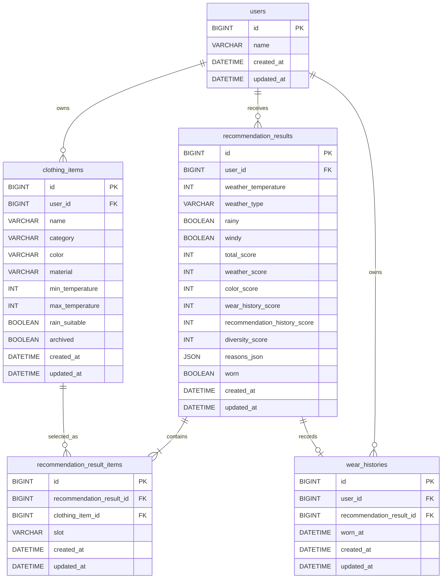

# ERD: SmartCloset 1차 MVP

## 1. 공통 DB 정책
- DB는 MySQL 기준으로 설계한다.
- 모든 JPA Entity는 `BaseTimeEntity`를 상속한다.
- 모든 테이블은 `created_at DATETIME(6) NOT NULL`, `updated_at DATETIME(6) NOT NULL`을 가진다.
- `RecommendationResultItem`과 `WearHistory`도 구현 단순성을 위해 `updated_at`을 포함한다.
- enum은 DB enum이 아니라 `VARCHAR(30)`으로 저장한다.
- 시간 컬럼은 애플리케이션에서 ISO-8601 문자열로 응답한다.
- `recommendation_results.reasons_json`은 `JSON NOT NULL`로 저장한다.
- Entity에서는 구현 단순성을 위해 `String reasonsJson`으로 보관한다.
- Application 계층 또는 converter에서 string list와 JSON string 변환을 담당한다.

## 2. Mermaid ERD

## 3. Tables

### users
| Column | Type | Nullable | Default | Description |
| --- | --- | --- | --- | --- |
| `id` | `BIGINT` | no | auto increment | PK |
| `name` | `VARCHAR(50)` | no | none | seed/test user name |
| `created_at` | `DATETIME(6)` | no | none | 생성 시각 |
| `updated_at` | `DATETIME(6)` | no | none | 수정 시각 |

Indexes:
- Primary key: `id`

Relations:
- `users.id` 1:N `clothing_items.user_id`
- `users.id` 1:N `recommendation_results.user_id`
- `users.id` 1:N `wear_histories.user_id`

### clothing_items
| Column | Type | Nullable | Default | Description |
| --- | --- | --- | --- | --- |
| `id` | `BIGINT` | no | auto increment | PK |
| `user_id` | `BIGINT` | no | none | FK to `users.id` |
| `name` | `VARCHAR(50)` | no | none | 옷 이름 |
| `category` | `VARCHAR(30)` | no | none | `ClothingCategory` |
| `color` | `VARCHAR(30)` | no | none | `ClothingColor` |
| `material` | `VARCHAR(30)` | no | none | `ClothingMaterial` |
| `min_temperature` | `INT` | no | none | 착용 가능 최저 기온 |
| `max_temperature` | `INT` | no | none | 착용 가능 최고 기온 |
| `rain_suitable` | `BOOLEAN` | no | none | 비 오는 날 적합 여부 |
| `archived` | `BOOLEAN` | no | `FALSE` | 보관 여부 |
| `created_at` | `DATETIME(6)` | no | none | 생성 시각 |
| `updated_at` | `DATETIME(6)` | no | none | 수정 시각 |

Indexes:
- Primary key: `id`
- Index: `(user_id, archived, id)`
- Index: `(user_id, category, archived)`

Relations:
- `clothing_items.user_id` N:1 `users.id`
- `clothing_items.id` 1:N `recommendation_result_items.clothing_item_id`

### recommendation_results
| Column | Type | Nullable | Default | Description |
| --- | --- | --- | --- | --- |
| `id` | `BIGINT` | no | auto increment | PK |
| `user_id` | `BIGINT` | no | none | FK to `users.id` |
| `weather_temperature` | `INT` | no | none | 추천 생성 시점의 기온 snapshot |
| `weather_type` | `VARCHAR(30)` | no | none | `WeatherType` snapshot |
| `rainy` | `BOOLEAN` | no | none | 비 조건 snapshot |
| `windy` | `BOOLEAN` | no | none | 바람 조건 snapshot |
| `total_score` | `INT` | no | none | 총점 |
| `weather_score` | `INT` | no | none | 날씨 적합도 점수 |
| `color_score` | `INT` | no | none | 색상 조합 점수 |
| `wear_history_score` | `INT` | no | none | 최근 착용 이력 점수 |
| `recommendation_history_score` | `INT` | no | none | 최근 추천 이력 점수 |
| `diversity_score` | `INT` | no | none | 다양성 보정 점수 |
| `reasons_json` | `JSON` | no | none | 추천 이유 JSON array |
| `worn` | `BOOLEAN` | no | `FALSE` | 착용 완료 여부 |
| `created_at` | `DATETIME(6)` | no | none | 생성 시각 |
| `updated_at` | `DATETIME(6)` | no | none | 수정 시각 |

Indexes:
- Primary key: `id`
- Index: `(user_id, created_at)`
- Index: `(user_id, worn)`

Relations:
- `recommendation_results.user_id` N:1 `users.id`
- `recommendation_results.id` 1:N `recommendation_result_items.recommendation_result_id`
- `recommendation_results.id` 1:0..1 `wear_histories.recommendation_result_id`

Reasons storage:
- DB column: `reasons_json JSON NOT NULL`
- Entity field: `String reasonsJson`
- Conversion: Application 계층 또는 converter가 string list와 JSON string을 변환한다.

### recommendation_result_items
| Column | Type | Nullable | Default | Description |
| --- | --- | --- | --- | --- |
| `id` | `BIGINT` | no | auto increment | PK |
| `recommendation_result_id` | `BIGINT` | no | none | FK to `recommendation_results.id` |
| `clothing_item_id` | `BIGINT` | no | none | FK to `clothing_items.id` |
| `slot` | `VARCHAR(30)` | no | none | `OutfitSlot` |
| `created_at` | `DATETIME(6)` | no | none | 생성 시각 |
| `updated_at` | `DATETIME(6)` | no | none | 수정 시각 |

Indexes:
- Primary key: `id`
- Index: `(recommendation_result_id)`
- Index: `(clothing_item_id)`
- Unique: `(recommendation_result_id, slot)`

Relations:
- `recommendation_result_items.recommendation_result_id` N:1 `recommendation_results.id`
- `recommendation_result_items.clothing_item_id` N:1 `clothing_items.id`

### wear_histories
| Column | Type | Nullable | Default | Description |
| --- | --- | --- | --- | --- |
| `id` | `BIGINT` | no | auto increment | PK |
| `user_id` | `BIGINT` | no | none | FK to `users.id` |
| `recommendation_result_id` | `BIGINT` | no | none | FK to `recommendation_results.id` |
| `worn_at` | `DATETIME(6)` | no | none | 착용 완료 시각 |
| `created_at` | `DATETIME(6)` | no | none | 생성 시각 |
| `updated_at` | `DATETIME(6)` | no | none | 수정 시각 |

Indexes:
- Primary key: `id`
- Index: `(user_id, worn_at)`
- Unique: `(recommendation_result_id)`

Relations:
- `wear_histories.user_id` N:1 `users.id`
- `wear_histories.recommendation_result_id` 1:1 `recommendation_results.id`

WearHistory는 개별 `clothing_item_id`를 중복 저장하지 않는다. 실제 포함 옷은 `recommendation_result_items`를 통해 조회한다.

## 4. Entity 설계 기준

### BaseTimeEntity
- 모든 JPA Entity는 `BaseTimeEntity`를 상속한다.
- `BaseTimeEntity`는 `createdAt`, `updatedAt`을 가진다.
- JPA Auditing으로 `created_at`, `updated_at`을 관리한다.

### 공통 Entity 정책
- 외부에서 setter를 남발하지 않는다.
- Entity 생성은 factory/static constructor 또는 명시적 생성 메서드로 제한한다.
- Entity 변경은 의도가 드러나는 메서드로 제한한다.
- Entity에 Lombok `@Data`, `@Setter`를 사용하지 않는다.
- Entity에는 `@Getter`와 protected no-args constructor 정도만 허용한다.

### User
주요 필드:
- `id`
- `name`
- `createdAt`
- `updatedAt`

연관관계:
- `User`는 `ClothingItem`, `RecommendationResult`, `WearHistory`의 소유자다.

생성/변경 메서드 후보:
- `createSeedUser(String name)`
- `rename(String name)`

### ClothingItem
주요 필드:
- `id`
- `user`
- `name`
- `category`
- `color`
- `material`
- `minTemperature`
- `maxTemperature`
- `rainSuitable`
- `archived`
- `createdAt`
- `updatedAt`

연관관계:
- `ClothingItem`은 하나의 `User`에 속한다.
- `RecommendationResultItem`에서 추천 결과의 슬롯별 옷으로 참조된다.

생성/변경 메서드 후보:
- `create(User user, String name, ClothingCategory category, ClothingColor color, ClothingMaterial material, int minTemperature, int maxTemperature, boolean rainSuitable)`
- `updateDetails(String name, ClothingCategory category, ClothingColor color, ClothingMaterial material, int minTemperature, int maxTemperature, boolean rainSuitable)`
- `archive()`
- `belongsTo(Long userId)`

`archive()`는 idempotent하게 동작한다.

### RecommendationResult
주요 필드:
- `id`
- `user`
- weather snapshot fields
- score breakdown fields
- `String reasonsJson`
- `worn`
- `items`
- `createdAt`
- `updatedAt`

연관관계:
- `RecommendationResult`는 하나의 `User`에 속한다.
- `RecommendationResult`는 여러 `RecommendationResultItem`을 가진다.
- `RecommendationResult`는 0개 또는 1개의 `WearHistory`를 가진다.

생성/변경 메서드 후보:
- `create(User user, WeatherCondition weather, RecommendationScore score, String reasonsJson)`
- `addItem(ClothingItem clothingItem, OutfitSlot slot)`
- `markWorn()`
- `isWorn()`

`markWorn()`은 idempotent하게 동작한다.

### RecommendationResultItem
주요 필드:
- `id`
- `recommendationResult`
- `clothingItem`
- `slot`
- `createdAt`
- `updatedAt`

연관관계:
- `RecommendationResultItem`은 하나의 `RecommendationResult`에 속한다.
- `RecommendationResultItem`은 하나의 `ClothingItem`을 참조한다.

생성/변경 메서드 후보:
- `of(RecommendationResult recommendationResult, ClothingItem clothingItem, OutfitSlot slot)`

### WearHistory
주요 필드:
- `id`
- `user`
- `recommendationResult`
- `wornAt`
- `createdAt`
- `updatedAt`

연관관계:
- `WearHistory`는 하나의 `User`에 속한다.
- `WearHistory`는 하나의 `RecommendationResult`를 참조한다.

생성/변경 메서드 후보:
- `record(User user, RecommendationResult recommendationResult, LocalDateTime wornAt)`

## 5. Enum 확정

### ClothingCategory
- `TOP`
- `BOTTOM`
- `OUTER`

### ClothingColor
- `BLACK`
- `WHITE`
- `GRAY`
- `NAVY`
- `BLUE`
- `BROWN`
- `BEIGE`
- `RED`
- `GREEN`
- `YELLOW`
- `UNKNOWN`

### ClothingMaterial
- `COTTON`
- `DENIM`
- `KNIT`
- `WOOL`
- `POLYESTER`
- `NYLON`
- `UNKNOWN`

### WeatherType
- `SUNNY`
- `CLOUDY`
- `RAINY`
- `SNOWY`
- `WINDY`

### OutfitSlot
- `TOP`
- `BOTTOM`
- `OUTER`

### RecommendationFailureCode
- `NO_TOP_AVAILABLE`
- `NO_BOTTOM_AVAILABLE`
- `NO_WEATHER_SUITABLE_ITEM`
- `OUTER_REQUIRED_BUT_NOT_AVAILABLE`
- `INSUFFICIENT_CLOSET_ITEMS`

## 정합성 메모
- PRD, ARCHITECTURE, RECOMMENDATION_RULES와 충돌하는 내용은 없다.
- 추천 생성 API의 최종 계약은 `POST /api/recommendations?userId={userId}`이다.
- `RecommendationResult`의 물리 저장 구조는 이 문서를 기준으로 한다.
