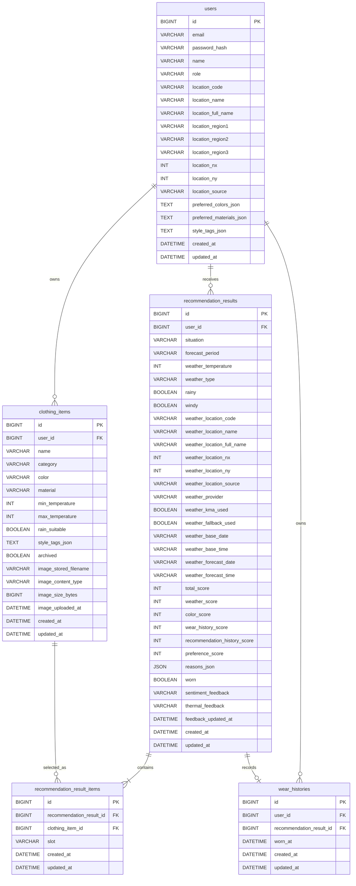

# ERD: SmartCloset MVP7

## 0. DB Baseline

MVP7 DB baseline은 MVP6 추천 피드백/개인화 schema에 사용자 위치 source와 추천 결과의 위치/날씨 source snapshot을 추가한다.

## MVP7 DB 결정

- 사용자 위치는 계속 `users` row에 저장한다.
- `users.location_source`를 추가해 위치 선택 경로를 저장한다.
- 브라우저 GPS 원문 좌표는 저장하지 않는다.
- 추천 결과 row에 forecast period와 위치/날씨 source snapshot을 저장한다.
- raw KMA 응답 JSON은 저장하지 않는다.
- 추천 피드백은 기존처럼 `recommendation_results` row의 최신 snapshot으로 저장한다.
- 옷 이미지 파일 bytes는 계속 DB에 저장하지 않는다.

## 1. 공통 DB 정책

- DB는 MySQL 기준으로 설계한다.
- 모든 JPA Entity는 `BaseTimeEntity`를 상속한다.
- 모든 테이블은 `created_at DATETIME(6) NOT NULL`, `updated_at DATETIME(6) NOT NULL`을 가진다.
- enum은 DB enum이 아니라 `VARCHAR(30)`으로 저장한다.
- JSON 값은 구현 단순성을 위해 Entity에서 `String`으로 보관한다.
- 운영 DB migration 전략은 별도 migration 도구 없이 Hibernate `ddl-auto=update`와 로컬 Docker Compose volume 초기화 기준으로 검증한다.

## 2. Mermaid ERD

## 3. Tables

### users

| Column | Type | Nullable | Default | Description |
| --- | --- | --- | --- | --- |
| `id` | `BIGINT` | no | auto increment | PK |
| `email` | `VARCHAR(255)` | no | none | 로그인 이메일, unique |
| `password_hash` | `VARCHAR(255)` | no | none | BCrypt hash |
| `name` | `VARCHAR(50)` | no | none | 사용자 표시 이름 |
| `role` | `VARCHAR(30)` | no | `USER` | 기본 role |
| `location_code` | `VARCHAR(30)` | yes | none | KMA 위치 catalog code |
| `location_name` | `VARCHAR(50)` | yes | none | 짧은 표시용 위치 이름 |
| `location_full_name` | `VARCHAR(100)` | yes | none | 전체 위치 표시명 |
| `location_region1` | `VARCHAR(50)` | yes | none | 1단계 행정구역 |
| `location_region2` | `VARCHAR(50)` | yes | none | 2단계 행정구역 |
| `location_region3` | `VARCHAR(50)` | yes | none | 3단계 행정구역 |
| `location_nx` | `INT` | yes | none | KMA grid X |
| `location_ny` | `INT` | yes | none | KMA grid Y |
| `location_source` | `VARCHAR(30)` | no | `MANUAL_SEARCH` | `LocationSource` |
| `preferred_colors_json` | `TEXT` | no | application `[]` | `ClothingColor` 배열 JSON 문자열 |
| `preferred_materials_json` | `TEXT` | no | application `[]` | `ClothingMaterial` 배열 JSON 문자열 |
| `style_tags_json` | `TEXT` | no | application `[]` | 선호 style tag 배열 JSON 문자열 |
| `created_at` | `DATETIME(6)` | no | none | 생성 시각 |
| `updated_at` | `DATETIME(6)` | no | none | 수정 시각 |

Indexes:

- Primary key: `id`
- Unique: `(email)`
- Index: `(location_code)`
- Index: `(location_nx, location_ny)`

Location policy:

- 신규 사용자는 `SEOUL`, `서울특별시`, `nx=60`, `ny=127`, `location_source=MANUAL_SEARCH`로 시작한다.
- 브라우저 GPS 원문 latitude/longitude는 `users`에 저장하지 않는다.
- catalog에 latitude/longitude가 있더라도 사용자 row snapshot에는 저장하지 않는다.

### clothing_items

MVP6 schema를 유지한다.

| Column | Type | Nullable | Default | Description |
| --- | --- | --- | --- | --- |
| `id` | `BIGINT` | no | auto increment | PK |
| `user_id` | `BIGINT` | no | none | FK to `users.id` |
| `name` | `VARCHAR(50)` | no | none | 옷 이름 |
| `category` | `VARCHAR(30)` | no | none | `ClothingCategory` |
| `color` | `VARCHAR(30)` | no | none | `ClothingColor` |
| `material` | `VARCHAR(30)` | no | none | `ClothingMaterial` |
| `min_temperature` | `INT` | no | none | 착용 가능 최저 기온 |
| `max_temperature` | `INT` | no | none | 착용 가능 최고 기온 |
| `rain_suitable` | `BOOLEAN` | no | none | 비 오는 날 적합 여부 |
| `style_tags_json` | `TEXT` | no | application `[]` | 옷별 style tag 배열 JSON 문자열 |
| `archived` | `BOOLEAN` | no | `FALSE` | 보관 여부 |
| `image_stored_filename` | `VARCHAR(255)` | yes | `NULL` | 서버가 생성한 저장 파일명 |
| `image_content_type` | `VARCHAR(100)` | yes | `NULL` | 검증된 MIME type |
| `image_size_bytes` | `BIGINT` | yes | `NULL` | 파일 크기 bytes |
| `image_uploaded_at` | `DATETIME(6)` | yes | `NULL` | 이미지 업로드 또는 교체 시각 |
| `created_at` | `DATETIME(6)` | no | none | 생성 시각 |
| `updated_at` | `DATETIME(6)` | no | none | 수정 시각 |

### recommendation_results

| Column | Type | Nullable | Default | Description |
| --- | --- | --- | --- | --- |
| `id` | `BIGINT` | no | auto increment | PK |
| `user_id` | `BIGINT` | no | none | FK to `users.id` |
| `situation` | `VARCHAR(30)` | no | `CASUAL` | 추천 생성 시점 `RecommendationSituation` snapshot |
| `forecast_period` | `VARCHAR(30)` | no | `CURRENT` | 추천 생성 시점 `ForecastPeriod` snapshot |
| `weather_temperature` | `INT` | no | none | 추천 생성 시점 `WeatherCondition.temperature` snapshot |
| `weather_type` | `VARCHAR(30)` | no | none | 추천 생성 시점 `WeatherCondition.weatherType` snapshot |
| `rainy` | `BOOLEAN` | no | none | 추천 생성 시점 `WeatherCondition.rainy` snapshot |
| `windy` | `BOOLEAN` | no | none | 추천 생성 시점 `WeatherCondition.windy` snapshot |
| `weather_location_code` | `VARCHAR(30)` | no | none | 추천 생성 시점 위치 code |
| `weather_location_name` | `VARCHAR(50)` | no | none | 추천 생성 시점 위치 name |
| `weather_location_full_name` | `VARCHAR(100)` | yes | none | 추천 생성 시점 위치 fullName |
| `weather_location_nx` | `INT` | no | none | 추천 생성 시점 KMA grid X |
| `weather_location_ny` | `INT` | no | none | 추천 생성 시점 KMA grid Y |
| `weather_location_source` | `VARCHAR(30)` | no | none | 추천 생성 시점 `LocationSource` |
| `weather_provider` | `VARCHAR(30)` | no | none | `KMA_VILAGE_FORECAST` 또는 `STATIC_FALLBACK` |
| `weather_kma_used` | `BOOLEAN` | no | none | KMA 결과 사용 여부 |
| `weather_fallback_used` | `BOOLEAN` | no | none | fallback 사용 여부 |
| `weather_base_date` | `VARCHAR(8)` | yes | none | KMA base date |
| `weather_base_time` | `VARCHAR(4)` | yes | none | KMA base time |
| `weather_forecast_date` | `VARCHAR(8)` | yes | none | 실제 선택 forecast date |
| `weather_forecast_time` | `VARCHAR(4)` | yes | none | 실제 선택 forecast time |
| `total_score` | `INT` | no | none | 총점 |
| `weather_score` | `INT` | no | none | 날씨 적합도 점수 |
| `color_score` | `INT` | no | none | 색상 조합 점수 |
| `wear_history_score` | `INT` | no | none | 최근 착용 이력 점수 |
| `recommendation_history_score` | `INT` | no | none | 최근 추천 이력 점수 |
| `preference_score` | `INT` | no | none | 선호/상황/styleTags/피드백 점수 |
| `reasons_json` | `JSON` | no | none | 추천 이유 JSON array |
| `worn` | `BOOLEAN` | no | `FALSE` | 착용 완료 여부 |
| `sentiment_feedback` | `VARCHAR(30)` | yes | `NULL` | `LIKED` 또는 `DISLIKED` |
| `thermal_feedback` | `VARCHAR(30)` | yes | `NULL` | `TOO_COLD` 또는 `TOO_HOT` |
| `feedback_updated_at` | `DATETIME(6)` | yes | `NULL` | 피드백 저장/수정 시각 |
| `created_at` | `DATETIME(6)` | no | none | 생성 시각 |
| `updated_at` | `DATETIME(6)` | no | none | 수정 시각 |

Indexes:

- Primary key: `id`
- Index: `(user_id, created_at)`
- Index: `(user_id, worn)`
- Index: `(user_id, feedback_updated_at)`
- Index: `(user_id, forecast_period, created_at)`
- Index: `(weather_location_code)`

Weather snapshot policy:

- 추천 생성 당시 사용자 위치와 weather source만 snapshot으로 저장한다.
- 사용자 위치가 나중에 바뀌어도 기존 추천 row의 weather location snapshot은 바뀌지 않는다.
- raw KMA response body는 저장하지 않는다.
- 브라우저 GPS 원문 좌표는 저장하지 않는다.
- `weather_kma_used`와 `weather_fallback_used`는 동시에 true가 될 수 없다.

Feedback snapshot policy:

- `sentiment_feedback`과 `thermal_feedback`이 모두 `NULL`이면 피드백이 없는 상태다.
- feedback clear 시 `sentiment_feedback`, `thermal_feedback`, `feedback_updated_at`을 모두 `NULL`로 되돌린다.
- 둘 중 하나라도 값이 있으면 `feedback_updated_at`은 `NOT NULL` application invariant다.
- 별도 feedback event log table은 만들지 않는다.

### recommendation_result_items

MVP6 schema를 유지한다.

### wear_histories

MVP6 schema를 유지한다.

## 4. Catalog resource

KMA 행정구역 catalog는 애플리케이션 리소스 또는 생성된 코드/CSV로 관리한다.

권장 resource shape:

| Field | Description |
| --- | --- |
| `code` | stable unique code |
| `region1` | 1단계 행정구역 |
| `region2` | 2단계 행정구역 |
| `region3` | 3단계 행정구역, nullable |
| `name` | 표시명 |
| `fullName` | 전체 표시명 |
| `nx` | KMA grid X |
| `ny` | KMA grid Y |
| `latitude` | nullable decimal |
| `longitude` | nullable decimal |

Catalog는 DB table로 만들지 않고 application resource로 시작한다. 이유: MVP7은 행정구역 검색 기능을 검증하는 단계이며, 사용자별 mutable data가 아니다.
