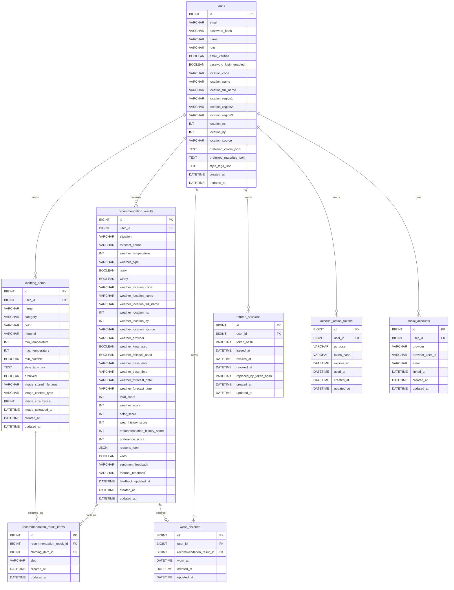

# ERD: SmartCloset MVP10

## 0. DB Baseline

MVP10 DB baseline은 MVP8 계정 안정성 완료 schema와 MVP9 UI/UX 리디자인 이후의 기존 옷장/추천 schema를 유지한다. MVP10은 사진 기반 AI 옷 등록 보조 MVP이며 DB schema를 변경하지 않는다.

## MVP10 DB 결정

- MVP8에서 `users`에 이메일 인증과 password login 상태를 추가했다.
- Refresh token은 `refresh_sessions`에 hash만 저장한다.
- 이메일 인증과 비밀번호 재설정 token은 `account_action_tokens`에 hash만 저장한다.
- Google social account 연결은 `social_accounts`에 저장한다.
- 계정 삭제는 soft delete가 아니라 관련 row hard delete다.
- 옷 이미지 파일 bytes는 계속 DB에 저장하지 않는다.
- AI 분석용 이미지는 DB에 저장하지 않는다.
- AI 분석 결과와 confidence는 DB에 저장하지 않는다.
- `ClothingAnalysisResponse`는 API/UI 후보 제안 DTO이며 entity가 아니다.
- AI 분석 결과는 추천 이력, 추천 score field, 추천 이유 JSON에 남기지 않는다.
- 운영 준비 이슈 #203부터 schema 생성/변경은 Flyway migration으로 추적한다.
- MVP10 AI 옷 등록 보조는 table, column, relation, index를 추가하지 않는다.

## 1. 공통 DB 정책

- DB는 MySQL 기준으로 설계한다.
- 모든 JPA Entity는 `BaseTimeEntity`를 상속한다.
- 모든 테이블은 `created_at DATETIME(6) NOT NULL`, `updated_at DATETIME(6) NOT NULL`을 가진다.
- enum은 DB enum이 아니라 `VARCHAR(30)`으로 저장한다.
- JSON 값은 구현 단순성을 위해 Entity에서 `String`으로 보관한다.
- Flyway baseline migration은 `src/main/resources/db/migration/V1__baseline_schema.sql`에 둔다.
- 깨끗한 MySQL DB는 Flyway migration만으로 현재 schema를 생성해야 한다.
- Hibernate `ddl-auto` 기본값은 `validate`이며, schema 변경 책임은 Hibernate 자동 변경이 아니라 `V*.sql` migration에 둔다.
- `local`/`demo` profile은 기존 로컬 volume 편입을 위해 `baseline-on-migrate=true`를 기본값으로 사용할 수 있다.
- `prod` profile은 Hibernate `update/create/create-drop` 계열 자동 schema 변경을 허용하지 않으며, 기존 운영 DB baseline 편입은 명시적으로 `SPRING_FLYWAY_BASELINE_ON_MIGRATE=true`를 설정한 배포 절차에서만 수행한다.
- DB backup은 `scripts/mysql-backup.sh`로 생성하고, restore는 `SMARTCLOSET_RESTORE_CONFIRM=restore scripts/mysql-restore.sh <backup.sql>`로 명시 확인 후 기존 DB에 dump를 replay한다.
- backup dump는 데이터 파일이며 `backups/` 아래 local artifact로 취급하고 커밋하지 않는다.

## 2. Mermaid ERD

## 3. Tables

### users

MVP7 schema에 아래 MVP8 column을 추가한다.

| Column | Type | Nullable | Default | Description |
| --- | --- | --- | --- | --- |
| `email_verified` | `BOOLEAN` | no | existing row `TRUE`, new password signup `FALSE` | 이메일 인증 완료 여부 |
| `password_login_enabled` | `BOOLEAN` | no | existing row `TRUE`, Google-only `FALSE` | password login 가능 여부 |

기존 `email`, `password_hash`, `name`, `role`, location snapshot, preference JSON column은 유지한다.

Indexes:

- Primary key: `id`
- Unique: `(email)`
- Index: `(location_code)`
- Index: `(location_nx, location_ny)`

정책:

- 기존 로컬 사용자 row는 MVP8 전환 시 `email_verified=true`, `password_login_enabled=true`로 취급한다.
- 새 password signup은 `email_verified=false`, `password_login_enabled=true`로 시작한다.
- 새 Google-only user는 `email_verified=true`, `password_login_enabled=false`로 시작한다.

### refresh_sessions

| Column | Type | Nullable | Default | Description |
| --- | --- | --- | --- | --- |
| `id` | `BIGINT` | no | auto increment | PK |
| `user_id` | `BIGINT` | no | none | FK to `users.id` |
| `token_hash` | `VARCHAR(255)` | no | none | refresh token hash |
| `issued_at` | `DATETIME(6)` | no | none | 발급 시각 |
| `expires_at` | `DATETIME(6)` | no | none | 만료 시각 |
| `revoked_at` | `DATETIME(6)` | yes | null | revoke 시각 |
| `replaced_by_token_hash` | `VARCHAR(255)` | yes | null | rotation 후 새 token hash |
| `created_at` | `DATETIME(6)` | no | none | 생성 시각 |
| `updated_at` | `DATETIME(6)` | no | none | 수정 시각 |

Indexes:

- Unique: `(token_hash)`
- Index: `(user_id, expires_at)`
- Index: `(user_id, revoked_at)`

정책:

- Raw refresh token은 저장하지 않는다.
- Refresh 성공 시 기존 row는 revoke되고 새 row가 생성된다.
- Password reset, account deletion 시 해당 user refresh sessions를 revoke 또는 delete한다.

### account_action_tokens

| Column | Type | Nullable | Default | Description |
| --- | --- | --- | --- | --- |
| `id` | `BIGINT` | no | auto increment | PK |
| `user_id` | `BIGINT` | no | none | FK to `users.id` |
| `purpose` | `VARCHAR(30)` | no | none | `EMAIL_VERIFICATION`, `PASSWORD_RESET` |
| `token_hash` | `VARCHAR(255)` | no | none | action token hash |
| `expires_at` | `DATETIME(6)` | no | none | 만료 시각 |
| `used_at` | `DATETIME(6)` | yes | null | 사용 완료 시각 |
| `created_at` | `DATETIME(6)` | no | none | 생성 시각 |
| `updated_at` | `DATETIME(6)` | no | none | 수정 시각 |

Indexes:

- Unique: `(token_hash)`
- Index: `(user_id, purpose, created_at)`
- Index: `(purpose, expires_at)`

정책:

- Raw token은 저장하지 않는다.
- Token은 single-use다.
- 만료 또는 사용 완료 token은 실패해야 한다.

### social_accounts

| Column | Type | Nullable | Default | Description |
| --- | --- | --- | --- | --- |
| `id` | `BIGINT` | no | auto increment | PK |
| `user_id` | `BIGINT` | no | none | FK to `users.id` |
| `provider` | `VARCHAR(30)` | no | none | `GOOGLE` |
| `provider_user_id` | `VARCHAR(255)` | no | none | provider subject |
| `email` | `VARCHAR(255)` | no | none | provider email snapshot |
| `linked_at` | `DATETIME(6)` | no | none | 연결 시각 |
| `created_at` | `DATETIME(6)` | no | none | 생성 시각 |
| `updated_at` | `DATETIME(6)` | no | none | 수정 시각 |

Indexes:

- Unique: `(provider, provider_user_id)`
- Index: `(user_id, provider)`
- Index: `(email)`

정책:

- Google verified email만 social login에 사용한다.
- 같은 email의 기존 user가 있으면 social account를 link한다.

### 기존 domain tables

아래 table은 MVP7 계약을 유지한다.

- `clothing_items`
- `recommendation_results`
- `recommendation_result_items`
- `wear_histories`

MVP8 계정 삭제 구현은 이 table들의 현재 사용자 소유 row를 삭제해야 한다. 이미지 bytes는 DB가 아니라 `ClothingImageStorage` 구현체가 관리한다.

## 4. 삭제 정책

계정 삭제는 즉시 hard delete다.

삭제 대상:

- `wear_histories` where `user_id = currentUserId`
- `recommendation_result_items` linked to current user's recommendation results
- `recommendation_results` where `user_id = currentUserId`
- `clothing_items` where `user_id = currentUserId`
- `refresh_sessions` where `user_id = currentUserId`
- `account_action_tokens` where `user_id = currentUserId`
- `social_accounts` where `user_id = currentUserId`
- `users` row
- clothing image files referenced by deleted clothing items

다른 사용자 row는 삭제하지 않는다.
