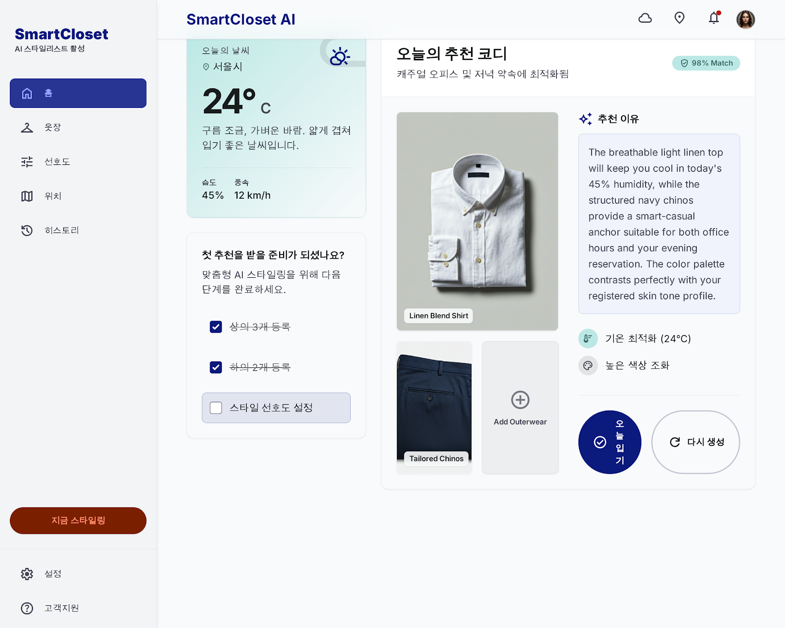
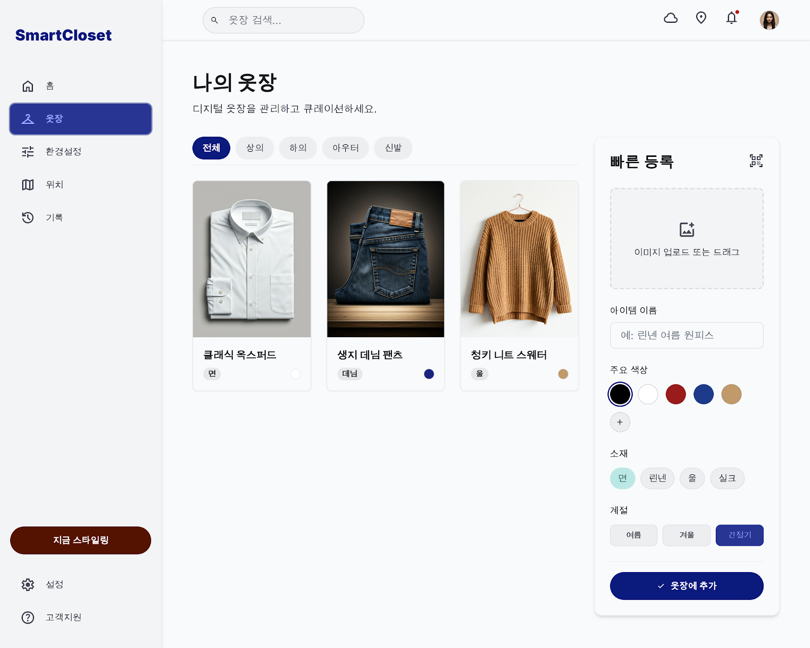
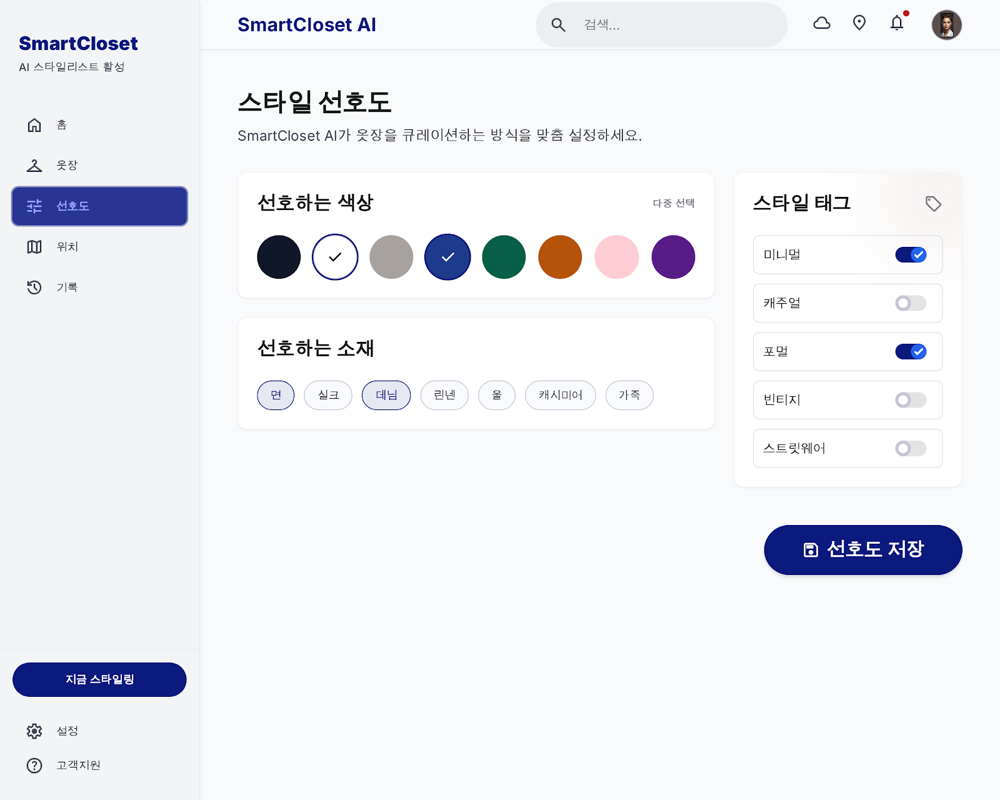
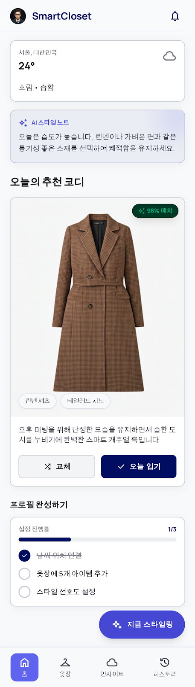
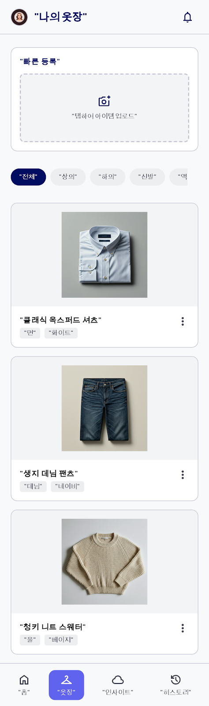
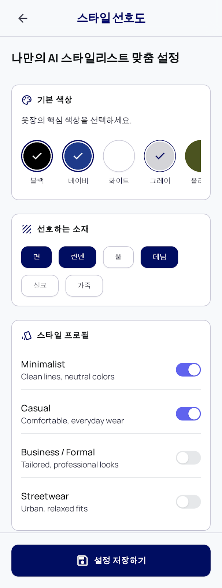
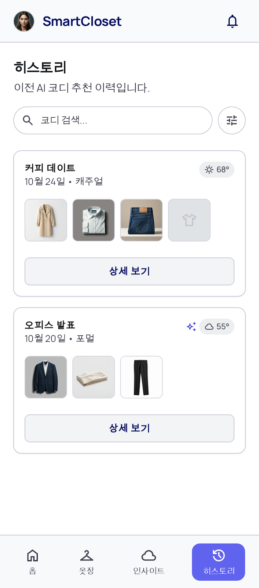

# MVP4 Design References

이 디렉터리는 MVP4 실사용 UX 구현 시 참고할 디자인 시안을 보관한다.

디자인 시안은 구현 참고 자료이며 최종 source of truth는 `docs/PRD.md`, `docs/FRONTEND.md`, `docs/API.md`, `docs/RECOMMENDATION_RULES.md`, `docs/adr/009-mvp4-usable-ux.md`다. 시안에 API 계약, 금지 범위, 문구가 문서와 충돌하면 문서를 우선한다.

## 사용 원칙
- 화면 구조와 밀도, 주요 CTA 배치, 카드/목록 리듬을 참고한다.
- 시안의 영어 enum, raw failure code, 과장 문구는 그대로 쓰지 않는다.
- "AI", "98% 매치", "스타일 예보"처럼 실제 기능보다 큰 기대를 주는 표현은 사용하지 않는다.
- 소셜 로그인, 비밀번호 재설정, 이메일 인증, 이미지 업로드, 외부 지도, 브라우저 현재 위치 요청은 구현하지 않는다.
- 위치 화면은 지도형 시안을 그대로 재현하지 않고, 현재 위치 표시, 검색, 내장 catalog 선택 UX만 참고한다.
- 모바일은 native app이 아니라 같은 React 웹앱의 반응형 레이아웃으로 구현한다.

## Desktop References

| File | Source draft | Usage |
| --- | --- | --- |
| `desktop/today.png` | `smartcloset_3` | Today view의 첫 추천 준비, 추천 결과, 이유 중심 구성을 우선 참고 |
| `desktop/closet.png` | `smartcloset_4` | Closet view의 목록 밀도, 등록/관리 흐름 참고 |
| `desktop/preferences.png` | `smartcloset_5` | Preferences view의 swatch/chip 선택 흐름 참고 |
| `desktop/auth-reference.png` | `smartcloset_2` | Auth view의 시각 톤만 참고. 소셜 로그인/비밀번호 찾기는 제거 |
| `desktop/location-reference.png` | `smartcloset_6` | Location view의 정보 배치만 참고. 지도 UI는 구현하지 않음 |

## Mobile References

| File | Source draft | Usage |
| --- | --- | --- |
| `mobile/today.png` | `smartcloset_ai_3` | 모바일 Today view의 첫 화면 기준 |
| `mobile/closet.png` | `smartcloset_ai_1` | 모바일 Closet view의 카드, 필터, 액션 참고 |
| `mobile/preferences.png` | `smartcloset_ai_6` | 모바일 Preferences view의 swatch/chip 흐름 참고 |
| `mobile/history.png` | `smartcloset_ai_4` | 모바일 History view의 이력 카드 참고 |
| `mobile/auth-reference.png` | `smartcloset_ai_5` | 모바일 Auth view의 화면 톤만 참고. 소셜 로그인/비밀번호 찾기는 제거 |
| `mobile/location-reference.png` | `smartcloset_ai_2` | 모바일 Location view의 검색/선택 흐름만 참고. 지도, 해외 도시, 현재 위치 감지는 제거 |

## 구현 시 반영할 수정 결정
- 로그인 후 기본 view는 `today`다.
- 데스크톱은 sidebar navigation, 모바일은 bottom tab navigation을 사용한다.
- 하단 탭은 `오늘`, `옷장`, `선호도`, `위치`, `이력` 5개로 고정한다.
- 추천 결과는 점수표보다 "오늘 입기 좋은 이유"와 옷 조합을 먼저 보여준다.
- 추천 실패는 `NO_TOP_AVAILABLE` 같은 내부 코드 대신 한국어 메시지와 CTA로 표시한다.
- 색상은 swatch, 소재는 chip, category/color/material enum은 한국어 라벨로 표시한다.
- 옷 등록에는 계절/기온 프리셋을 제공하되 서버 enum이나 DB schema는 바꾸지 않는다.
- 옷 목록에서는 수정과 보관 액션이 모바일에서도 hover 없이 접근 가능해야 한다.

## 원본 위치
원본은 작업 당시 아래 로컬 폴더에서 가져왔다.

- `/Users/jiho/Downloads/stitch_smart_weather_stylist`
- `/Users/jiho/Downloads/stitch_mobile_ui_layout_conversion`

원본 다운로드 폴더는 구현 기준이 아니다. Harness phase와 구현 작업은 이 디렉터리의 복사본과 현재 `docs/` 문서를 기준으로 진행한다.
